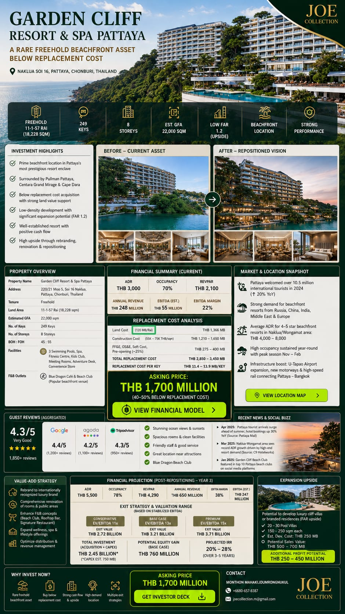
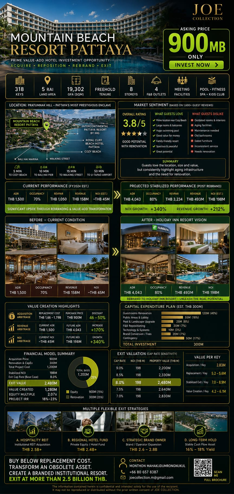

<!-- LUXURY BRANDING HEADER BY JOE COLLECTION -->

  
  <!-- 1. ชื่อแบรนด์สไตล์ Timeless Luxury -->
  
    JOE COLLECTION
  
  
  <!-- เส้นคั่นทองเหลืองสไตล์โรงแรม 5 ดาว -->
  

  
  <!-- 2. พาดหัวประกาศขายสินทรัพย์พรีเมียม -->
  <h1 style="font-family: 'Georgia', serif; font-size: 26px; font-weight: 400; color: #d4af37; letter-spacing: 3px; text-transform: uppercase; margin-top: 10px; margin-bottom: 8px; border: none;">
    PRIME ASSETS FOR SALE
  </h1>
  
  <!-- 3. สโลแกนภาษาอังกฤษระดับสากล -->
  

    Curated Portfolio of Ultra-Luxury Hospitality & Premium Real Estate
  

  

## 🏢 1. Garden Cliff Resort & Spa Pattaya
**Concept:** 5-Star Luxury Beachfront Resort with Low-Density Architecture and Private Beach Access in Prime Naklua, Pattaya.

### 📍 Location & Strategic Advantages
*   **Address:** 220/21, Moo 5, Soi 16 Naklua, Pattaya, Chonburi, Thailand.
*   **High-End Neighborhood:** Surrounded by ultra-luxury hospitality brands including *Pullman Pattaya Hotel*, *Centara Grand Mirage*, and *Cape Dara Resort*.
*   **Tenure:** **Freehold** (Chanote Title Deed - Ready for absolute ownership transfer).

### 📊 Summary of Key Facts
*   **Property Name:** Garden Cliff Resort & Spa Pattaya
*   **No. of Keys:** 249 Premium Keys & Suites
*   **No. of Storeys:** 8 Storeys (Elegant Low-Rise Beachfront Architecture)
*   **Site Area:** 11-1-57 Rai (4,557 Sq.wah or 18,228 sq.m.)
*   **Total GFA:** Approx. 22,000 sq.m.
*   **FAR:** **1.2** 💡 *(Low FAR - Offering Significant Upside for Future Expansion)*
*   **BOH : FOH Ratio:** 45 : 55 (Highly optimized back-of-house vs. front-of-house efficiency)

### 🍽️ Premium Facilities & Outlets
*   **F&B Highlight:** **Blue Dragon Cafe & Beach Club** – A highly popular beachfront destination and the resort's signature social check-in point.
*   **Resort Amenities:** Meeting Facilities, Swimming Pools, Fitness Centre, Spa, Adventure Desk, Convenience Store.

### 📈 Financial & Average Performance Overview
*   **Average Daily Rate (ADR):** 3,000 THB
*   **Occupancy Rate (OCC):</strong> 70%
*   **Annual Revenue:** 248 Million THB (MB)

> ### 💰 INVESTMENT ASKING PRICE
> **THB 1,700,000,000 (1,700 MB)**

*Exterior view of Garden Cliff Resort & Spa Pattaya*

👉 **[📊 CLICK HERE TO ACCESS CONFIDENTIAL FINANCIAL REPORT](https://joecollection.github.io/gardencliff-pattaya/)**  
👉 **[📥 CLICK HERE TO DOWNLOAD HOTEL PITCH DECK (PDF)](garden-cliff-analysis.pdf)**

---

## 🏢 2. Mountain Beach Resort Pattaya
**Concept:** Well-Established 4-Star Resort on Pratamnak Hill, Pattaya, Currently Managed by a Renowned Hospitality Operator with Strong Cash Flow and Stable Returns.

### 📍 Location & Strategic Advantages
*   **Address:** 378/16, Moo 12, Nongprue Sub-district, Banglamung, Chonburi, Thailand.
*   **Prime Neighborhood:** Strategically situated on the exclusive Pratamnak Hill (Cosy Beach area), surrounded by prestigious luxury properties including *Royal Cliff Beach Hotel Pattaya*, *InterContinental Pattaya Resort*, and *Cosy Beach Hotel*.
*   **Tenure:** **Freehold** (Chanote Title Deed - Ready for absolute ownership transfer).

### 📊 Summary of Key Facts
*   **Property Name:** Mountain Beach Resort Pattaya
*   **Current Operator:** Destination Hospitality Management Co., Ltd.
*   **No. of Keys:** 318 Generously Sized Keys & Suites (High Volume Inventory)
*   **No. of Storeys:** 8 Storeys (Classic Structural Layout)
*   **Built / Opening:** Opened 1989 (Proven track record of long-term stability)
*   **Site Area:** 5-0-0 Rai (2,000 Sq.wah or 8,000 sq.m.)
*   **Total GFA:** Approx. 19,302 sq.m.

### 🍽️ Premium Facilities & Outlets
*   **F&B Variety:** **4 Outlets** – Offering a wide range of dining experiences.
*   **Resort Amenities:** Meeting Facilities, Swimming Pools, Fitness Centre, Luxury Spa.

### 📈 Financial & Average Performance Overview
*   **Average Daily Rate (ADR):** 1,500 THB
*   **Occupancy Rate (OCC):** 70%
*   **Annual Revenue:** 158 Million THB (MB)

> ### 💰 INVESTMENT ASKING PRICE
> **THB 900,000,000 (900 MB)**

*Exterior view of Mountain Beach Resort Pattaya*

👉 **[📊 CLICK HERE TO ACCESS CONFIDENTIAL FINANCIAL REPORT](https://joecollection.github.io/mountain-beach/)**  
👉 **[📥 CLICK HERE TO DOWNLOAD HOTEL PITCH DECK (PDF)](mb-resort.pdf)**

---

*Note: Financial due diligence reports and transaction structures are protected under standard Non-Disclosure Agreements (NDA).*

---

## 📞 Contact Information
*   **Monthon Mahakijdumrongnukul**
*   **Mobile:** +6680-657-8387
*   **Email:** joecollection.m@gmail.com
